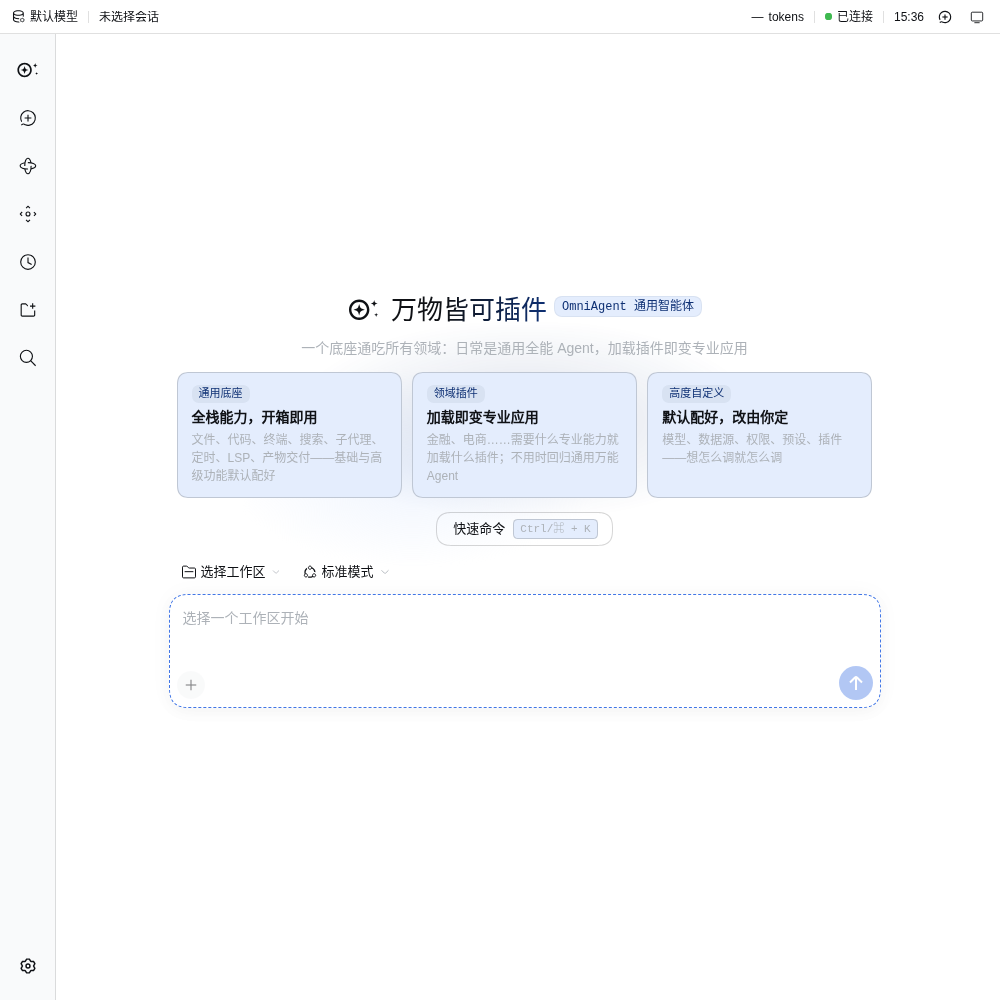
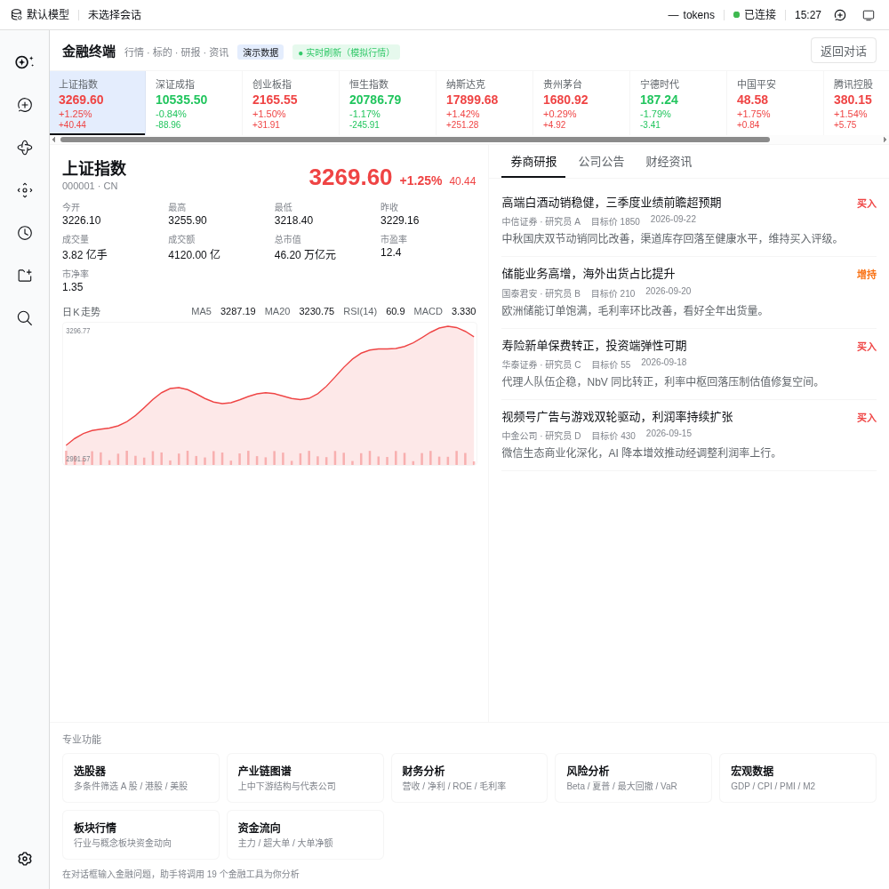
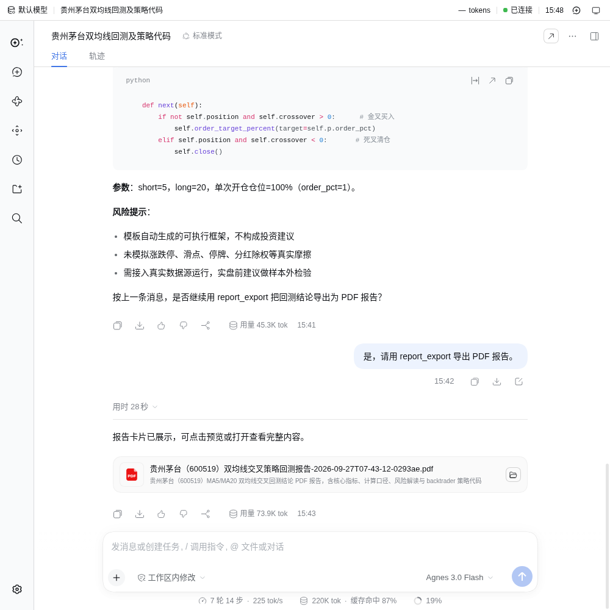
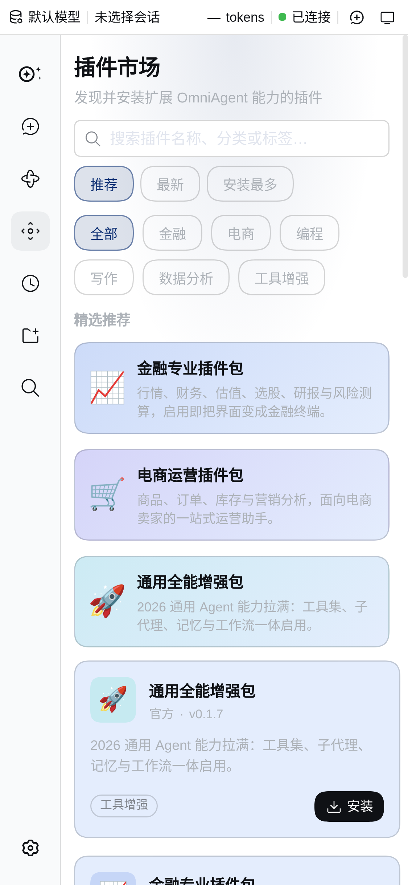
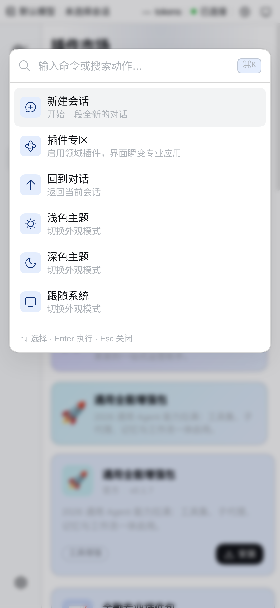
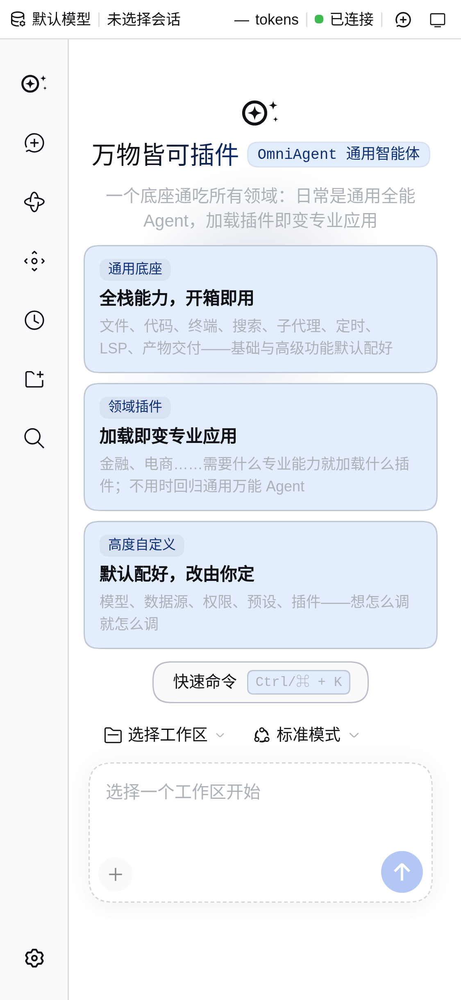

# OmniAgent (`oa`) — a universal agent where everything is a plugin

**English** · [简体中文](README.zh.md)

> One base, N professions. With no plugin installed it is an out-of-the-box general-purpose agent; install a plugin and the same agent instantly becomes a professional app for that vertical; remove it and the agent returns to general-purpose — **the general capabilities are never weakened**.

[](https://github.com/X33834/OmniAgent/actions/workflows/ci.yml)
[](https://gitcode.com/badhope/OmniAgent)
[](LICENSE)
[](package.json)
[](package.json)
[](#quick-start)

> Website: **[x33834.github.io/OmniAgent](https://x33834.github.io/OmniAgent/)** — product overview, screenshots and docs

## Screenshots

| Desktop home — universal base (light) | Finance terminal |
|:---:|:---:|
|  |  |

| Agent coding & one-click PDF report | Plugin marketplace |
|:---:|:---:|
|  |  |

| Global command palette (Ctrl / ⌘ + K) | Mobile home (responsive) |
|:---:|:---:|
|  |  |

## What this is

OmniAgent is not an agent dedicated to a single industry; it is a universal agent platform built on the idea that **everything can be a plugin**:

- **The base is itself a fully-featured general-purpose agent**: file I/O, command execution, web search, reasoning, the toolchain and the Web UI all work on their own, with no plugin installed, for everyday tasks.
- **All domain capabilities come from plugins**: package a vertical's domain knowledge and tools (even its whole UI) into a plugin. On install, the same agent instantly gains that domain's persona, tools and professional interface; on removal, it returns to the general base — capabilities **stack**, they are not rebuilt from scratch.
- **Load it when needed, drop it when not**: open the plugin marketplace and enable a domain with one click; the UI and toolset turn into the professional app. When you don't need it, it is still the general-purpose agent.
- **One base unifies every vertical**: a "single base + plugin ecosystem" replaces the chaos of vertical agents that each go their own way and never converge.

## Quick start

### Requirements

- **Node.js** `^22.19.0` (or `>=24.0.0`)
- **pnpm** `11.7.0` (the repo pins `packageManager`)

### Install

```bash
git clone <your-fork>.git omniagent
cd omniagent
pnpm install
pnpm run build        # produces the host/client libs and the web frontend artifacts
```

### Configure a model key

OmniAgent reaches any LLM endpoint over the OpenAI-compatible protocol. Pick one:

**Option 1: Agnes AI (example overlay shipped in the repo)**

```bash
export AGNES_API_KEY=sk-...
```

Then start with `config/agnes-ai.patch.yml` attached:

```bash
pnpm oa web --patch config/agnes-ai.patch.yml
```

**Option 2: DeepSeek (the finance/ecommerce domain bundles ship with a default route)**

```bash
export DEEPSEEK_API_KEY=sk-...
```

The base bundle also presets OpenAI-compatible providers for Qwen (`DASHSCOPE_API_KEY`), Zhipu GLM (`ZHIPU_API_KEY`) and Ollama (local); switch between them on the "Models" page in the Web settings. Any OpenAI-compatible endpoint (vLLM, a local model gateway, etc.) extends the same way.

### Run

```bash
# Web UI (defaults to http://127.0.0.1:3080; --no-open skips opening the browser)
pnpm run start:web            # equivalent to pnpm oa web

# One-shot command-line conversation (headless)
pnpm run dsh headless "tidy up this directory and write a README"
#   equivalent to pnpm oa headless "..."
```

### Load a plugin

There are three ways to gain domain capabilities:

1. **Web plugin marketplace**: open the "Plugins" page in the Web sidebar and toggle the bundled official plugins (off by default) on or off — these are the `OPTIONAL_BUNDLES`.
2. **Switch domain profile**: start directly with a domain profile and the UI instantly becomes the professional app:
   ```bash
   pnpm oa finance "check the latest quote and valuation for Kweichow Moutai"
   pnpm oa ecommerce "expand keywords for 'wireless bluetooth earbuds'"
   ```
3. **Install an external plugin**:
   ```bash
   pnpm oa plugin --profile web add <npm-package | Git URL | tarball | local-path>
   ```

## Core features

### Universal base (`dsh-base`, out of the box)

Chat and session management, session persistence with automatic titles, branching timeline, global command palette, top status bar (model/session/token/connection/clock/theme), plugin marketplace and plugin management, long-term memory and knowledge base, fine-grained permission rules (allow/auto/ask/deny plus wildcards), background job queue, scheduled tasks, workspace change tracking (review/rollback), OS-level system notifications, browser notifications on the Web, MCP client, the skill system, sandboxed execution with approvals, and multi-model routing.

### Official plugins shipped with the package

| Plugin | Bundle | Description |
|---|---|---|
| **Finance terminal** | `@deepseek-ai/dsh-finance` | 19 finance tools: quotes/financials/valuation/K-line/fund flows/announcements/news/macro/industry/risk/fixed income/FX/technical indicators; multi-factor screening (PE/PB/ROE/change), dual-moving-average and dollar-cost-averaging backtests, natural language to quant code; a matching `ui-finance` professional panel (quote bar polling, instrument details, SVG K-line, screener table, industry-chain map); one-click export to a real PDF report |
| **E-commerce operations** | `@deepseek-ai/dsh-ecommerce` | Keyword expansion, title optimization, market insight, product selection scoring, review analysis, price-band analysis, live-selling scripts, campaign planning |
| **General enhancement** | `@deepseek-ai/dsh-general-full` | LSP language-server seam, scheduled tasks, deliverable presentation (present), workspace change tracking, computer-use / browser-use automation registries (lazily mounted, activated once a driver is installed) |

### Advanced capabilities

- **Multi-agent DAG orchestration**: `agent_team_run` supports `dependsOn` topological ordering between roles, parallel execution within a stage, serial execution across stages, and injection of upstream output into downstream roles.
- **Hybrid memory retrieval**: pure-TypeScript BM25 (Chinese bigram tokenization) plus pluggable embedding (local TF / OpenAI-compatible endpoint) vector recall, fused with an `alpha` weight, degrading automatically when no key is configured.
- **Real PDF export**: pure-JS rendering on pdfkit (no Chromium), with embedded Chinese subsets, tables, code blocks, Markdown images, `<!-- chart:bar|line -->` vector bar/line charts, and page footers.
- **Message-level actions**: export a message as a Markdown download, or edit a user message and fork to re-run.
- **Engineered experience**: "open in new tab" for code blocks, virtualized session history (500+ entries render only the visible window), responsive mobile layout (768px/480px breakpoints), and model parameter sliders (temperature / maxTokens, persisted in localStorage).

## Repository layout

```
omniagent/
├── packages/               # monorepo workspace (320+ internal packages)
│   ├── boot/               # profile startup, bundle/plugin loading, PROFILE_TEMPLATES
│   ├── host/               # host side: webserver, frontend-static, directory picker, notifications
│   ├── client/             # browser-side React UI: ui-* panels and slots
│   ├── core/ llm/ session/ memory/ guard/ tools/ util/ ...
│   ├── finance/ ecommerce/ # domain agent plugins (host half)
│   └── bundle/             # profile bundles: base / web-app / headless / finance / ecommerce / general-full
├── apps/
│   ├── cli/                # oa / dsh command-line entry (bin.ts)
│   ├── web/                # web frontend project (vite)
│   └── desktop/ desktop-host/  # Electron desktop shell
├── config/                 # example overlay (agnes-ai.patch.yml)
├── scripts/                # build, codegen, constraint checks, rebrand and other engineering scripts
├── docs/                   # architecture, code audit, markdown safety, editor evaluation and other docs
└── native/ python/ vendor/ # native modules / Python SDK / vendored third-party dependencies
```

## Plugins and ecosystem

### "Everything can be a plugin"

A domain plugin = one agent plugin package (host half: data contracts + pure logic + tools + persona injection) + one profile bundle (a `cordis.patch.yml` declaring `dsh.bundle.patch`, optionally mounting client-half UI slots). Tools depend only on data contracts, decoupled from any specific data source; sample data must carry a `mock` marker and be disclosed to the user.

The full plugin development guide is in **[`docs/plugin-dev.md`](docs/plugin-dev.md)**. **Want to build your own plugin? Start from the minimal template**: copy [`packages/bundle/plugin-template/`](packages/bundle/plugin-template/) → rename the package → write your own tool, working end-to-end in five minutes (see "Start from the template" at the top of the guide). For complete examples, see `packages/finance/finance-agent/` and `packages/ecommerce/ecommerce-agent/`.

### Where to get plugins

1. **Official bundles**: shipped with the install, off by default, enabled with one click on the Web "Plugins" page (`OPTIONAL_BUNDLES`).
2. **External install**: `oa plugin --profile <p> add <spec>` supports npm packages / Git URLs / tarballs / local paths.
3. **Build your own**: package and publish following the pattern above, and anyone can install it.

## Development

```bash
pnpm run dev:web        # rebuild the client bundle and hot-reload on source changes
pnpm run typecheck      # full typecheck (host → client)
pnpm run lint           # oxlint
make help               # Web / Desktop related Make targets
```

## License

[MIT](LICENSE). Third-party dependencies and their licenses are listed in [THIRD_PARTY_NOTICES.md](THIRD_PARTY_NOTICES.md).

> This repository is a derivative release built on the DSH (DeepSeek Harness) system; the MIT copyright line in LICENSE (Copyright (c) 2026 DeepSeek) is retained verbatim for compliance and has not been modified.
